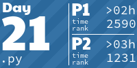

# Advent of Code 2024
I used the [Advent Of Code](https://adventofcode.com/) tasks for learning different languages.

For 2024 I have not done this, as I had little time I wrote them in a language I am farmiliar with.
The tasks from 2024 have been solved in [python](https://python.org/).

<!-- AOC TILES BEGIN -->
<h1 align="center">
  2024 - 42 ⭐ - Python
</h1>

<!-- AOC TILES END -->

[AoC Tiles](https://github.com/LiquidFun/aoc_tiles) by LiquidFun